# Formation OpenTelemetry

## Chapitre 1 — Introduction


---

## Objectifs de la formation

- Améliorer l'**observabilité** de vos applications avec OpenTelemetry
- Couvrir **l'intégration, la configuration et l'utilisation** des composantes de la plateforme
- **~65 % de pratique** : une stack complète tourne sur votre machine dès ce matin

**Fil rouge** 🔭 : vous rejoignez l'équipe SRE de l'**Astronomy Shop** (démo officielle OpenTelemetry). Un nouveau micro-service Java, `review-service`, vient d'être livré : **il est invisible**. En 2 jours, vous le rendez observable de bout en bout.

---

## Monitoring vs observabilité (1/2)

- **Monitoring** : surveiller des symptômes **connus à l'avance**
  - « le CPU dépasse 80 % », « le service ne répond plus »
  - dashboards et alertes figés, par composant

- Le monitoring classique ne suffit plus :
  - micro-services : une requête traverse **10+ services**
  - défaillances **émergentes**, pas de « root cause » unique
  - environnements éphémères (conteneurs, autoscaling)

---

## Monitoring vs observabilité (2/2)

- **Observabilité** : comprendre un état interne **à partir des signaux émis**
  - « pourquoi les commandes des clients allemands échouent-elles depuis 14h ? »
  - poser des questions **non prévues** au moment de l'instrumentation
    - sans redéployer ni ajouter de code : la réponse est déjà dans les signaux
    - on cherche les *unknown unknowns*, pas seulement les pannes anticipées


---

## Les trois piliers



| Signal | Exemple |
|--------|---------|
| **Logs** | `Payment declined for order 42` |
| **Métriques** | `http_requests_total`, latence p99 |
| **Traces** | parcours d'une requête à travers 10 services |

- Chaque pilier seul est **insuffisant**
- La valeur naît de la **corrélation** : de l'alerte (métrique) à la trace, de la trace au log

---

## Anatomie d'une métrique

<!-- _class: bigcode -->

*À quoi ça sert : **détecter**. Peu volumineuse, on la garde des mois — c'est elle qui déclenche l'alerte.*

```
http_requests_total{route="/reviews", status="201"}  1428
└────── nom ──────┘└────────── attributs ─────────┘  └──┘
                                                    valeur
```

- **Nom** : ce qu'on compte — ici les requêtes HTTP reçues
- **Attributs** (aussi appelés *labels* ou *dimensions*) : comment on découpe la mesure — ici la route et le code retour
- **Valeur** : le relevé, ré-enregistré à intervalle régulier
- Une métrique existe donc en **autant d'exemplaires que de combinaisons d'attributs**
- Logs et traces portent le même genre d'attributs : recoupement possible

---

## Anatomie d'une trace

<!-- _class: bigcode -->

*À quoi ça sert : **localiser**. Temps consommé par service/étape*

```
trace_id 4bf92f3577b34da6 — une requête, du premier au dernier octet

POST /api/reviews         ████████████████████████    82 ms  review-service
├─ GET /api/products/42    ██████                     21 ms  frontend
└─ ReviewRepository.save           ███████████        38 ms  review-service
   └─ INSERT otel                     ███████         24 ms  → PostgreSQL
```

- **Span** : une opération — un nom, un instant de début, une durée, des attributs
- **Trace** : tous les spans d'une requête, reliés par le même **`trace_id`**
- Chaque span connaît son **parent** : cascade, et durée de chaque étage
- La trace franchit les frontières de services (`review-service` → `frontend`) : **propagation de contexte**
- Accès par **Jaeger** dès le lab 1

---

## Anatomie d'un log

<!-- _class: bigcode -->

*À quoi ça sert : **expliquer**. C'est le seul signal qui porte le détail de ce qui s'est passé.*

```
2026-09-01T14:32:07.412Z  ERROR  review-service
  "Review rejected: rating out of range"
  trace_id=4bf92f3577b34da6  span_id=00f067aa0ba902b7
```

- Horodatage, **sévérité**, message : le log que vous écrivez déjà aujourd'hui
- Il peut être **structuré** — champs, et non plus une ligne à découper à la regex
  - en échange, il est plus volumineux et illisible sans outil : le pour/contre au chapitre 5
- Et il porte le **`trace_id` de la trace précédente** : un clic suffit pour passer du log à la requête qui l'a produit
- Détaillé au chapitre/lab 5

---

## Du monitoring à l'observabilité 2.0

- **Corrélation** : tous les signaux partagent le même contexte (`trace_id`, `service.name`)
- Un dashboard classique ne répond qu'aux questions posées **avant** l'incident
  - il faut avoir décidé à l'avance ce qu'on mesure, et comment on le découpe
- **Wide events** : **un seul événement par requête**, avec tout dedans — client, version, région, latence, code retour
  - la question se choisit **après coup** : « les requêtes lentes du client acme »
  - c'est ce que devient une trace enrichie d'informations métier (chapitre 7)
- La tendance : ne plus séparer les 3 piliers en silos, mais les **relier par le contexte**

---

## OpenTelemetry : définition


- Projet **CNCF** (fusion d'OpenTracing et OpenCensus, 2019)
- 2ᵉ projet le plus actif de la CNCF après Kubernetes
- Un **standard ouvert** pour produire et transporter la télémétrie :
  - **API & SDK** par langage (Java, Go, Python, .NET...)
  - **Protocole OTLP**
  - **Conventions sémantiques**
  - **Collecteur**
- Ce que le standard **ne couvre pas** : le stockage et la visualisation
  - pas de base de données, pas de dashboard → Jaeger, Prometheus, Grafana, vendors...

---

## Écosystème et architecture



- L'application émet via le **SDK** (ou un agent zero-code)
- Le **collecteur** centralise, transforme, route
- Les **backends** stockent ; Grafana fédère la visualisation

---

## Conventions sémantiques

- Le **cœur de la valeur** d'OpenTelemetry : une **convention de nommage** partagée par tout l'écosystème
- `service.name`, `http.request.method`, `http.response.status_code`, `db.system`...
- Conséquences :
  - les dashboards et alertes deviennent **portables**
  - les outils **comprennent** les données sans configuration
  - la corrélation entre signaux devient **automatique**
- Registre officiel : <https://opentelemetry.io/docs/specs/semconv/>

---

## Le protocole OTLP



- **O**pen**T**e**L**emetry **P**rotocol : un protocole unique pour les 3 signaux
- Deux transports :
  - **gRPC** — port `4317`
  - **HTTP/protobuf** — port `4318`
- Utilisé de bout en bout : SDK → collecteur → collecteur → backend
- Payload binaire (protobuf), compression, batching : conçu pour le volume

---

## API, SDK, distributions, fournisseurs



- **API** : les interfaces (`Tracer`, `Meter`, `Logger`) — dépendance des bibliothèques
  - no-op par défaut : instrumenter une lib ne coûte rien si le SDK est absent
- **SDK** : l'implémentation — échantillonnage, processors, exporters
- **Distributions** : un SDK/collecteur pré-packagé par un éditeur
  (Grafana, Datadog, AWS ADOT, Elastic...)
- **Fournisseurs** : backends compatibles OTLP — le standard évite le **vendor lock-in** :
  on change de backend sans réinstrumenter

---

## 🧪 LAB 1 — Démarrage de la stack

- Créer le cluster Kind et installer la démo OpenTelemetry
- Accéder à Grafana, Jaeger et à la boutique
- Suivre une commande de bout en bout dans Jaeger
- Constater que `review-service` est **invisible**

➡ [Lab 1 — Démarrage de la stack d'observabilité](https://k8s-school.fr/labs/otel/fr/1_labs/10-otel-stack/index.html)

*Livrable : une trace de checkout complète dans Jaeger.*
