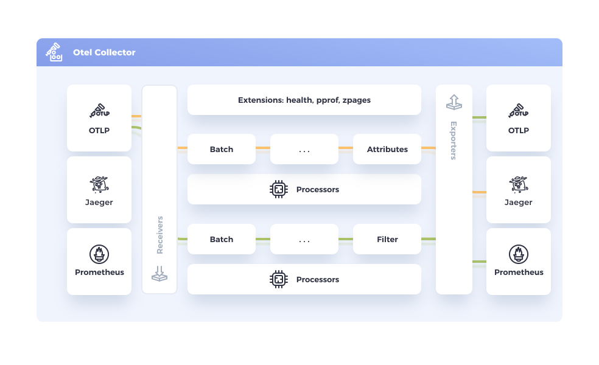

# Formation OpenTelemetry

## Chapitre 3 — Le collecteur


---

## Pourquoi un collecteur ?

- Le SDK **pourrait** exporter directement vers Jaeger/Prometheus... mais :
  - chaque appli devrait connaître **tous les backends** (config dupliquée)
  - pas de **tampon** : un backend lent fait souffrir l'application
  - impossible de **transformer/filtrer** centralement (PII, coûts, routage)
- Le collecteur **découple** producteurs et consommateurs :
  - l'appli n'a qu'une cible : **OTLP vers le collecteur**
  - la plateforme décide du reste, **sans redéployer les applis**

---

## Le pipeline (1/2)

<!-- _footer: "Schéma : opentelemetry.io — CC BY 4.0" -->



---

## Le pipeline (2/2)

- **receivers** (entrée) → **processors** (transformation) → **exporters** (sortie)
- Un **pipeline par signal** : `traces`, `metrics`, `logs` — les deux rangées du schéma
- Les **extensions** ne voient passer aucune donnée
- Les **connectors** relient deux pipelines (la sortie de l'un devient l'entrée de l'autre)

---

## Installation & modes de déploiement

- Un binaire Go unique, configuré en YAML — chart Helm officiel
- **Agent** : un collecteur près de chaque application — en K8s un **DaemonSet**,
  un pod par nœud (le mode de la démo)
- **Gateway** : un pool central de collecteurs — un **Deployment** que l'on scale



---

## Pourquoi souvent les deux ?

- L'**agent** fait ce qui ne peut se faire que sur place :
  - lire les métriques du nœud (`hostmetrics`) et les logs de fichiers (`filelog`)
  - retrouver le pod émetteur pour l'annoter (`k8sattributes`) — vue de la gateway,
    l'IP source est celle d'un nœud, pas celle d'un pod
- La **gateway** porte les règles communes à toute la flotte :
  - sampling cohérent (voir toutes les parties d'une trace au même endroit)
  - routage multi-backends, et les **secrets** des backends, en un seul endroit
- Conséquence : changer de backend ne touche que la gateway,
  ni les agents, ni les applications

---

## Distributions

- **Core** : les composants essentiels, maintenus par le projet
- **Contrib** : ~100 receivers/processors/exporters communautaires
  - c'est l'image de la démo (`otel/opentelemetry-collector-contrib`)
- **Distributions vendors** : [AWS ADOT](https://aws-otel.github.io/) · [Grafana Alloy](https://grafana.com/docs/alloy/latest/) · [Splunk](https://github.com/signalfx/splunk-otel-collector) · [Datadog DDOT](https://docs.datadoghq.com/opentelemetry/setup/ddot_collector/)
  - des **builds du collecteur upstream**, sous Apache 2.0 comme lui : composants présélectionnés, réglages par défaut du vendor, support commercial
  - le propriétaire, c'est le **backend** derrière, pas le collecteur
- **Builder `ocb`** : composer son collecteur sur mesure — uniquement les composants nécessaires, donc une surface d'attaque réduite ([doc](https://opentelemetry.io/docs/collector/custom-collector/))

---

## Configuration : les 4 sections

```yaml
receivers:                 # 1. ce qui fait ENTRER la donnée
  otlp:
    protocols: { grpc: { endpoint: 0.0.0.0:4317 } }
processors:                # 2. ce qu'on lui fait au passage
  batch: {}
exporters:                 # 3. ce qui la fait SORTIR
  debug: { verbosity: detailed }
service:                   # 4. ce qui est réellement ACTIF
  pipelines:
    traces:
      receivers: [otlp]
      processors: [batch]
      exporters: [debug]
```

- Les trois premières sections **déclarent** des composants, `service` les **branche**
- Un composant déclaré mais absent de `service.pipelines` n'est **jamais chargé**
- Deux sections optionnelles suivent la même règle : `extensions`, `connectors`

---

## Receivers

- Font entrer la donnée : en **push** (la source envoie) ou en **pull** (le collecteur interroge)
- **`otlp`** : LE receiver standard, en **push** — gRPC 4317 / HTTP 4318.
  C'est l'appli qui ouvre la connexion ; le collecteur ne connaît pas ses clients
- **`hostmetrics`** : CPU, mémoire, disque, réseau du nœud — en **pull**
- Autres receivers en pull : `postgresql`, `kafkametrics`, `prometheus`
  - ils interrogent la source à chaque `collection_interval`
- `filelog` : suit des fichiers de logs sur le nœud

```yaml
receivers:
  postgresql:
    endpoint: postgresql:5432
    username: root
    password: otel
```

---

## Processors (1/2)

- Transforment la donnée **entre** réception et export
- **`memory_limiter`** : garde-fou mémoire
- **`batch`** : regroupe avant export
- **`attributes` / `resource`** : ajouter/supprimer/modifier des attributs
- **`filter`** : jeter des données (spans de healthcheck, métriques inutiles...)
- **`transform`** : transformations avancées avec le langage **OTTL**
- **`resourcedetection`** : enrichit avec l'environnement (host, cloud, K8s)

---

## Processors (2/2) — l'ordre compte

L'ordre de la liste **est** l'ordre d'exécution. Ordre recommandé :

1. **`memory_limiter`** — délester avant d'accumuler
2. ce qui **jette** de la donnée (`filter`, échantillonnage)
3. ce qui dépend du contexte de connexion (`k8sattributes`)
4. ce qui **enrichit** / transforme (`resource`, `transform`)
5. **`batch`** — inutile de regrouper ce qui sera jeté ou modifié après

```yaml
processors: [memory_limiter, resourcedetection, resource, transform, batch]
```

⚠️ Le [schéma officiel](https://opentelemetry.io/docs/collector/) place `Batch` en
tête : c'est une illustration du *concept* de pipeline, pas une prescription.

---

## Le langage OTTL

- **O**penTelemetry **T**ransformation **L**anguage : `set()`, `delete_key()`, `replace_pattern()`... + conditions `where`
- Exemple réel de la démo (normalisation des noms de spans du frontend) :

```yaml
transform:
  trace_statements:
    - context: span
      statements:
        - set(span.attributes["http.route"], "/api/cart")
          where IsMatch(span.attributes["http.target"], "\\/api\\/cart")
```

- Le même langage servira au **masquage des données sensibles** (module Sécurité, J2)

---

## Connectors

- Relient la **sortie** d'un pipeline à l'**entrée** d'un autre
- **[`forward`](https://github.com/open-telemetry/opentelemetry-collector/tree/main/connector/forwardconnector)** : chaînage simple
- **[`routing`](https://github.com/open-telemetry/opentelemetry-collector-contrib/tree/main/connector/routingconnector)** : aiguiller selon une condition (par tenant, par environnement)
- **`count`** / **`spanmetrics`** : dériver des **métriques** depuis des spans
  - la démo utilise `spanmetrics` : latences/débits par opération calculés
    depuis le pipeline traces, sans instrumenter les applis

---

## Exporters

- Font sortir la donnée vers les backends
- **`debug`** : affiche dans les logs du collecteur — l'outil n°1 de mise au point
- **`file`** : écrit dans un fichier (archivage, debug)
- **`otlp` / `otlphttp`** : vers tout backend compatible OTLP
- Dans la démo :

```yaml
traces  → otlp/jaeger         (OTLP gRPC, port 4317)
metrics → otlphttp/prometheus (OTLP HTTP, /api/v1/otlp)
logs    → opensearch          (HTTP/JSON, API _bulk, port 9200)
```

- OpenSearch **ne parle pas OTLP** : l'exporter traduit les LogRecords en JSON et
  les POSTe par paquets sur son API `_bulk`, dans l'index `otel-logs-AAAA-MM-JJ`

---

## Extensions

- Fonctions transverses, hors du flux de données
- **`health_check`** : endpoint HTTP de vivacité (probes K8s)
- **`zpages`** : pages web de debug embarquées
  - `/debug/pipelinez` : les pipelines actifs et leurs composants
  - `/debug/tracez` : échantillons de spans récents

```yaml
service:
  extensions: [health_check, zpages]
```

---

## Synthèse : le collecteur de la démo



- **3 pipelines** indépendants, une même config, **zéro modification applicative**
- Un composant n'existe que s'il est **cité dans `service.pipelines`**
- Ajouter une source = ajouter un receiver **et** le brancher au pipeline

---

## 🧪 LAB 3 — Configurer le collecteur

- Lire la configuration réelle du collecteur de la démo
- Ajouter le receiver **`hostmetrics`** (métriques système)
- Ajouter le receiver **`postgresql`** (métriques produit — la base de `review-service`)
- Activer **zPages** et observer le pipeline
- Vérifier les nouvelles métriques dans **Prometheus**

➡ [Lab 3 — Configuration du collecteur](https://k8s-school.fr/labs/otel/fr/1_labs/30-otel-collector/index.html)

*Livrable : métriques `system_*` et `postgresql_*` visibles dans Prometheus.*
