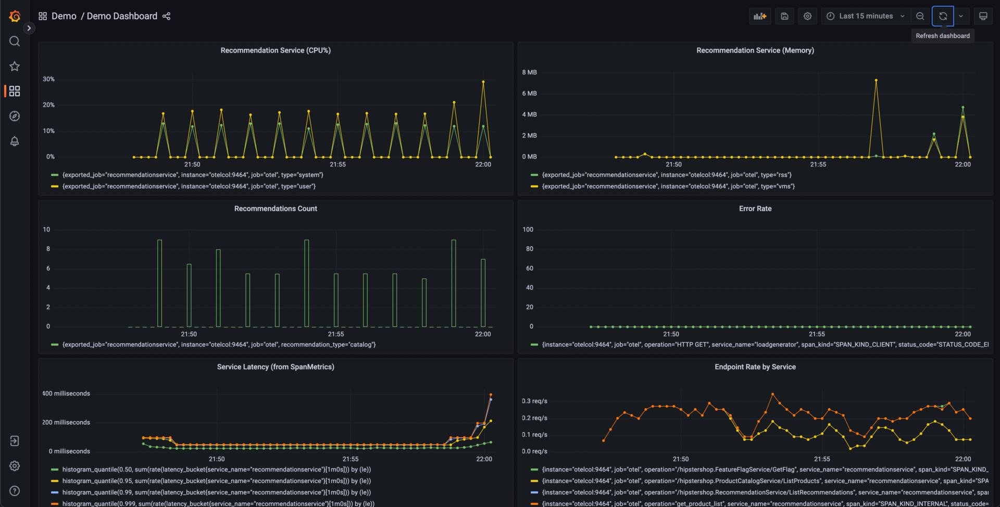

# Formation OpenTelemetry

## Chapitre 4 — Grafana


---

## Grafana dans la chaîne OTel

- Grafana ne **stocke rien** : il fédère la visualisation des backends
- Dans la démo, tout est déjà câblé (provisionné par le chart Helm) :

| Signal | Backend | Datasource |
|--------|---------|------------|
| Métriques | Prometheus | `webstore-metrics` |
| Traces | Jaeger | `webstore-traces` |
| Logs | OpenSearch | `webstore-logs` |

---

## Un dashboard, concrètement

<!-- _footer: "Capture : opentelemetry.io — CC BY 4.0" -->

Chaque panel a **sa** requête — ici la latence vient de `spanmetrics` (chapitre 3)



---

## Alerting : l'anatomie d'une règle

Une règle = une **requête** + une **condition** + une **durée**. La requête est écrite
dans le langage de la datasource — ici du **PromQL**, et elle ne contient aucun seuil

```promql
histogram_quantile(0.95, sum(rate(
  traces_span_metrics_duration_milliseconds_bucket{service_name="review-service"}[2m]
)) by (le))
```

- La **condition** est un objet distinct, une expression *Threshold* : `> 20` (ms)
- La **durée** (`for: 1m`) sépare un pic isolé d'un incident
- États : `Normal` → `Pending` (le seuil est franchi) → `Firing` (il l'est depuis `for`)
- **Contact points** : Slack, mail, webhook, OnCall — aucun n'est configuré dans la démo

---

## Alerting : sur quoi ?

- Alerter sur les **symptômes**, ce que l'utilisateur subit : latence, taux d'erreur
- Pas sur les **causes** — CPU, mémoire, saturation de pool :
  - un CPU à 90 % peut être parfaitement sain : c'est une machine bien utilisée
  - un CPU à 30 % n'empêche pas un service d'être inutilisable
  - une alerte qui ne correspond à aucune dégradation vécue finit par être ignorée
- Les causes gardent toute leur valeur **en dashboard** : une fois l'alerte partie,
  ce sont elles qui expliquent
- La règle du lab suit ce principe : elle surveille le **p95** du `review-service`,
  pas la charge de son pod

---

## Exemplars : du point de métrique à la trace

- Le p95 dit **qu'il y a** un problème, jamais **quelle requête** l'a subi :
  une métrique est une agrégation
- Un **exemplar** est une mesure individuelle conservée à côté de l'agrégat,
  avec le `trace_id` de la requête qui l'a produite
- Grafana la pose en marqueur sur le panel : survol = valeur + `trace_id`, clic = la trace


- Dans la démo, seules les métriques des **SDK** en portent : `spanmetrics` est déclaré avec `{}`, qui n'en produit aucun — le **Lab 4.1** le démontre et donne la ligne qui manque

---

## Visualisations

- **Time series** : l'essentiel des métriques (débit, latence, saturation)
- **Stat / Gauge** : valeur instantanée, SLO
- **Table** : inventaires, résultats de recherche de traces
- **Logs panel** : flux de logs avec niveau et détail dépliable
- **Traces panel** : waterfall de spans dans Grafana
- Bonnes pratiques : peu de panels, des unités correctes, le service en variable

---

## 🧪 LAB 4 — Dashboard unifié

- Explorer les 3 datasources provisionnées
- Construire deux panels (métriques, traces), importer le reste
- Variable `service_name` pour basculer entre les services
- Une règle d'alerte sur la latence p95
- Exporter le dashboard en JSON (livrable à committer)
- Lab 4.1 : les exemplars, du point de métrique à la trace

➡ [Lab 4 — Dashboard unifié](https://k8s-school.fr/labs/otel/fr/1_labs/40-otel-grafana/index.html)

---

## Annexe — Datasources

- Une datasource = un backend + sa configuration de requête
- Provisionnables **par fichier YAML** (infra-as-code, comme dans la démo)
- Le vrai pouvoir : les **liens entre datasources**
  - **exemplars** : d'un point de métrique → la trace qui l'a produit —
    `exemplarTraceIdDestinations` y nomme l'UID de la datasource Jaeger (**Lab 4.1**)
  - **tracesToLogsV2** : d'une trace → les logs corrélés
  - champ `traceId` d'un log → *View in Jaeger*
- C'est la **corrélation** du chapitre 1, rendue cliquable

---

## Annexe — Dashboards

- Organisation : dossiers, tags, permissions
- **Variables** (`$service_name`...) : un dashboard générique pour N services

```promql
label_values(traces_span_metrics_calls_total, service_name)
```

- Export/import **JSON** : versionnable dans Git — c'est le livrable du lab
- Provisionnement par ConfigMap (sidecar Grafana) : les dashboards de la démo arrivent comme ça
