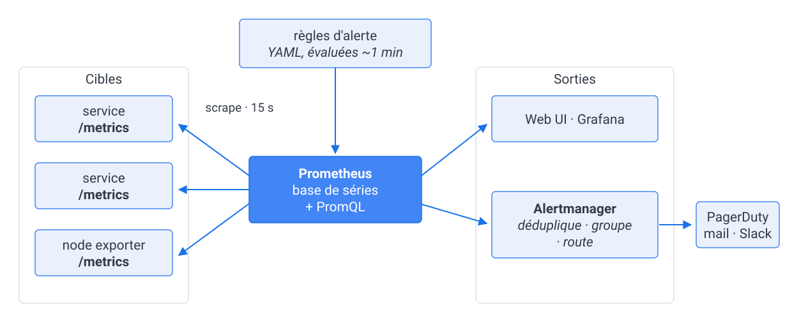

<!-- _class: title -->

# Formation OpenTelemetry

## Chapitre 6 — Métriques

&nbsp;&nbsp;&nbsp;&nbsp;&nbsp;&nbsp;&nbsp;&nbsp;&nbsp;&nbsp;&nbsp;&nbsp;

---

## Quoi mesurer ? RED pour les services, USE pour les ressources

| | Pour quoi | Les trois questions | Dans la démo |
|---|---|---|---|
| **RED** | un service qui répond à des requêtes | **R**ate : combien de req/s · **E**rrors : combien échouent · **D**uration : en combien de temps | `spanmetrics` (chapitre 3), le dashboard *Spanmetrics* |
| **USE** | une ressource : CPU, disque, mémoire, pool | **U**tilization : à quel point elle est occupée · **S**aturation : ce qui **attend** parce qu'elle est pleine · **E**rrors | `hostmetrics` (Lab 3), `kubeletstats` |

- Utilisation ≠ saturation : un CPU à 100 % sans file d'attente sert tout le monde ;
  il sature quand le *load* dépasse le nombre de cœurs, quand les I/O font la queue,
  quand la mémoire swappe. La saturation monte **avant** la latence
- RED dit *ce que le client subit*, USE dit *combien de marge il reste* —
  d'où la règle du chapitre 4 : **alerter sur RED, expliquer avec USE**
- Google SRE dit « *golden signals* » : latence, trafic, erreurs, saturation — RED + S

---

## Prometheus, le standard de fait

- Né chez SoundCloud en 2012, inspiré de **Borgmon** (Google), open source en 2015 —
  deuxième projet diplômé de la CNCF, après Kubernetes
- Il sert deux besoins, et deux seulement :
  **alerter** quand ça casse, suivre les **tendances** longues
- Quatre partis pris qui expliquent tout le reste :
  - **pull** : c'est lui qui va chercher la donnée, à intervalle fixe
  - **multi-dimensionnel** : un nom + des labels = autant de séries
  - **métriques uniquement** : ni logs, ni traces

---

## Le modèle pull

- Chaque cible expose un `/metrics` en HTTP ; Prometheus le **scrape** (15 s par défaut), horodate lui-même, et découvre ses cibles seul (Kubernetes, Consul, fichiers)



---

## Le modèle de données

- Une **métrique** = nom + unité + type + points de données horodatés
- Chaque série porte des **attributs** (dimensions) : `{method="POST", status="201"}`
- **Temporalité** : cumulative (Prometheus) ou delta
- ⚠️ **Cardinalité** : chaque combinaison d'attributs = une série
  - une note d'avis de 1 à 5 → 5 séries : gratuit
  - `user_id` dans une métrique → une série par client = explosion mémoire garantie
---

<!-- _class: bigcode -->

## Le format d'exposition

```text
# HELP http_requests_total Total number of HTTP requests made.
# TYPE http_requests_total counter
http_requests_total{code="200",path="/status"} 8
```

- `http_requests_total` : le **nom** — suffixe `_total` par convention pour un compteur
- `{code="200",path="/status"}` : les **labels**, c'est-à-dire les dimensions
- `8` : la **valeur** au moment du scrape ; l'horodatage, c'est Prometheus qui le pose
- Du texte, lisible avec un `curl` — c'est tout le protocole

---

## Les types d'instruments (API OpenTelemetry)

| Instrument | Usage | Exemple |
|------|-------|---------|
| **Counter** | cumul monotone | `reviews.created` |
| **UpDownCounter** | cumul ± | connexions actives |
| **Gauge** | valeur instantanée | température, taille de file |
| **Histogram** | distribution | latence (p50/p95/p99) |

- L'histogramme est le grand gagnant pour les latences :
  buckets → percentiles calculables a posteriori
- ⚠️ Ce sont les instruments de l'**API**, pas les types du backend qui les reçoit :
  côté Prometheus, l'`UpDownCounter` arrive en `gauge`, et le `summary` de Prometheus  n'a aucun instrument OTel qui le produise

---

## Java : l'API OpenTelemetry

- Même chaîne de types dans tous les langages :
  **`MeterProvider` → `Meter` → instrument**

```java
Meter meter = GlobalOpenTelemetry.getMeter("fr.k8sschool.reviews");
LongCounter created = meter.counterBuilder("reviews.created").build();
DoubleHistogram duration = meter
     .histogramBuilder("reviews.creation.duration").setUnit("ms").build();
created.add(1, Attributes.of(RATING, 5L));   // attribut = dimension
```

- Pour **compiler**, une seule dépendance dans le `pom.xml` (l'agent, lui, ne s'y déclare jamais) :

```xml
<dependency>
  <groupId>io.opentelemetry</groupId>
  <artifactId>opentelemetry-api</artifactId>
</dependency>
```

- **API ≠ SDK** : sans SDK **installé**, l'API est **no-op** — le code tourne et ne
  produit rien. L'agent du Lab 2 installe le SDK de l'extérieur
- Le nom passé à `getMeter()` = **scope d'instrumentation** (`otel.scope.name`)

---

## Java : et Micrometer ?

- La façade métriques **standard de Spring** (fournie par Actuator) :
  toute application Spring en a déjà

```java
Timer.builder("reviews.creation.time")
     .publishPercentileHistogram()
     .register(registry);
```

- L'agent OTel fait le **pont** : meter Micrometer → métrique OTLP
- ⚠️ Pont **opt-in** : `OTEL_INSTRUMENTATION_MICROMETER_ENABLED=true`
- Annotations : `@Timed`, `@Counted` (Micrometer) — même résultat en déclaratif
- Code neuf → **API OTel** (seul chemin pour les traces et les logs) ;
  patrimoine Micrometer → **le pont**, pas une réécriture

---

## Les *Views* : renommer, filtrer, agréger

- Une **View** modifie un instrument **sans toucher au code** — elle vit
  dans le `MeterProvider`, pas dans l'application
- Trois usages : **renommer** une métrique, **jeter un attribut** trop
  cardinal, **changer l'agrégation** (les seuils d'un histogramme)

```java
// Sur le compteur reviews.created, ne garder que l'attribut app.review.rating :
// tout autre attribut posé par le code (un user.id, par exemple) est jeté avant l'export
SdkMeterProvider.builder().registerView(
    InstrumentSelector.builder().setName("reviews.created").build(),
    View.builder().setAttributeFilter(Set.of("app.review.rating")).build());
```

- Avec l'**agent**, cela se fait par fichier YAML
- Le réflexe : **d'abord la View**, la métrique n'est pas encore émise.
  Filtrer au collecteur arrive après le transport, et coûte déjà.

---

<!-- _class: bigcode -->

## PromQL

« Quelle proportion de requêtes HTTP échoue, par route ? »

```promql
sum by(path) (rate(http_requests_total{status="500"}[5m]))
  / sum by(path) (rate(http_requests_total[5m]))
```

- `rate()` : la **pente** d'un compteur cumulé sur une fenêtre —
  un compteur brut ne se lit jamais tel quel (il ne fait que monter, et repart à 0 au redémarrage)
- `sum by(...)` : agréger en ne gardant que les dimensions utiles
- Des fonctions font de la prospective :
  `predict_linear(node_filesystem_free[1h], 4*3600) < 0` — « ce disque sera plein dans 4 h »

---

## Alerter : la règle, puis Alertmanager

- La règle vit **dans Prometheus** : du YAML versionné, évalué toutes les minutes environ
- Prometheus ne notifie personne : il **pousse ses alertes vers Alertmanager**, qui
  - **déduplique** — dix instances qui crient la même chose font une seule alerte
  - **groupe** — une notification pour tout un service, pas trente
  - **route** vers la bonne équipe, gère les **silences** de maintenance
- Grafana embarque son propre Alertmanager et fait la même chose (chapitre 4) ;
  la différence est ailleurs : la règle Prometheus vit **en YAML avec le code**,
  et elle est évaluée **même si Grafana est éteint**

---

## Ce que change OTLP

| | Prometheus historique | OTLP |
|---|---|---|
| Transport | texte sur HTTP, en **pull** | protobuf, en **push** |
| Portée | métriques | **traces, métriques, logs** |
| Identité | labels ajoutés au scrape | **resource attributes** émis par l'appli |
| Corrélation | par convention de nommage | `trace_id` porté par la mesure (**exemplars**) |

- L'application n'écrit plus *pour Prometheus* : elle émet de l'OTLP, et la plateforme
  choisit le backend — sans redéploiement, comme au chapitre 3
- Un compteur dit s'il est **cumulé depuis le démarrage** (`CUMULATIVE`) ou **depuis le
  dernier envoi** (`DELTA`) — Prometheus supposait le premier sans le dire

---

## Temporalité : delta ou cumulative ?

| | Ce que porte chaque point |
|---|---|
| **Cumulative** | le total depuis le démarrage (le compteur monte) |
| **Delta** | l'incrément depuis l'export précédent |

- Ne concerne que les **compteurs** et les **histogrammes** : une gauge est une
  valeur instantanée (la température, la taille d'une file), elle n'a pas de temporalité
- Prometheus ne connaît que le **cumulatif** : `rate()` calcule la pente
- Le SDK OpenTelemetry exporte en **cumulative** par défaut ; le connector `count`
  et les backends type Datadog/StatsD parlent **delta**
- D'où le processor **`deltatocumulative`** du Lab 6 bonus : sans lui, l'endpoint
  OTLP de Prometheus répond **HTTP 500** et le collecteur jette les points
- ⚠️ Le symptôme est muet : `Exporting failed. Dropping data.` dans les
  logs du collecteur, et des courbes vides dans Grafana

---

## Prometheus et OTLP ensemble, dans la démo

- Prometheus accepte l'OTLP **nativement** : la démo démarre son serveur avec
  `--web.enable-otlp-receiver`, et le collecteur y pousse

```yaml
exporters:
  otlphttp/prometheus:
    endpoint: http://prometheus:9090/api/v1/otlp
```

- Traduction des noms à l'entrée : `reviews.created` → `reviews_created_total`
- Les resource attributes deviennent des labels, sur une liste choisie
  (`promote_resource_attributes` : `service.name`, `k8s.pod.name`, `k8s.namespace.name`…)
- L'historique Prometheus: **PromQL**, la découverte de cibles, ses centaines d'exporters.
  Ce qu'OTel apporte : **une** instrumentation pour les trois signaux

---

## Côté collecteur

- Receiver **`prometheus`** : scraper des `/metrics` existants (compatibilité)
- Exporter **`prometheus`** : exposer un `/metrics` à scraper
- Receivers « produit » : `postgresql`, `kafkametrics`, `hostmetrics` (Lab 3)
- **Connectors** traces → métriques :
  - **`spanmetrics`** : débit + latence par opération (déjà actif dans la démo)
  - **`count`** : compter des événements (ex : spans en erreur)
- Des métriques **sans instrumenter** : dérivées des traces

---

## 🧪 LAB 6 — Métriques métier

- **Partie 1** : compteur + histogramme avec l'**API OpenTelemetry** dans
  `review-service`, export via l'agent, latence p95 en PromQL
- **Partie 2** : le **pont Micrometer** — un flag, et le patrimoine Spring suit
- **Partie 3** : connector **`count`** — compter les spans en erreur,
  `app_spans_errors_total` sans une ligne de code

➡ [Lab 6 — Métriques métier](https://k8s-school.fr/labs/otel/fr/1_labs/60-otel-metrics/index.html)

*Livrable : graphe de latence + compteur métier + métrique dérivée.*
