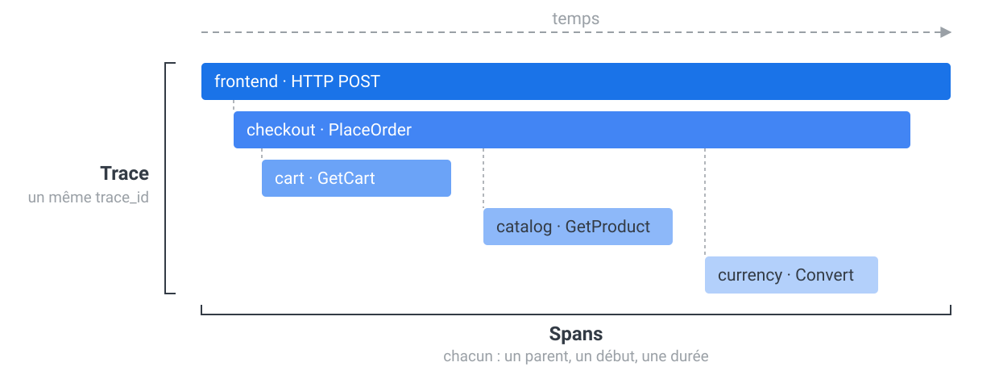
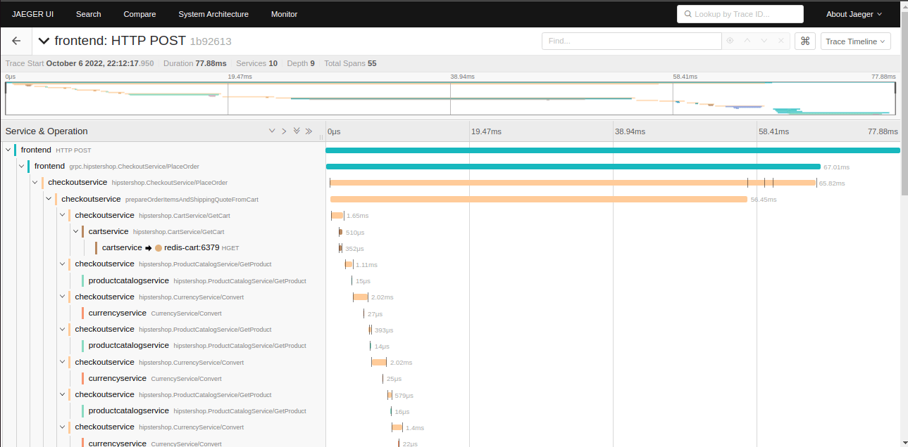

# Formation OpenTelemetry

## Chapitre 7 — Traces


---

## Une trace, c'est des spans dans le temps



- Un enfant **tient dans les bornes de son parent** : il commence après lui et finit avant —
  le parent, c'est l'appel qui attend (pointillés : qui a déclenché qui)
- Deux frères ne se recouvrent **que** s'ils sont exécutés en parallèle ;
  ici les trois appels de `checkout` sont séquentiels

---

## La même trace, dans Jaeger

<!-- _footer: "Capture : opentelemetry.io — CC BY 4.0" -->



- À gauche l'arbre des appels, à droite la même chose à l'échelle du temps
- Quels services sont intervenus, dans quel ordre, pour quelle durée

---

## Le chemin d'une trace



- L'application n'écrit jamais dans Jaeger : elle émet de l'**OTLP** vers le collecteur,
  qui décide de la suite (chapitre 3) — changer de backend ne la concerne pas

---

<!-- _class: bigcode -->

## Un span

```text
trace_id  = a91c…          span_id = 7d24…       parent_span_id = 3f01…
name      = "GET /api/reviews"                   kind  = SERVER
début     = 12:04:07.412   durée = 38 ms         statut = OK
attributs = { http.route: "/api/reviews", db.system: "postgresql" }
events    = [ 12:04:07.430 : "exception", … ]
```

- Les **attributs** décrivent l'opération : des clés/valeurs, normalisées par les
  conventions sémantiques (`http.*`, `db.*`) ou à vous (`app.review.rating`)
- Les **events** sont des instants datés **à l'intérieur** du span : une exception, un retry
- Les **links** pointent vers une **autre** trace : le message publié ici, consommé ailleurs

---

## Une trace

- Tous les spans qui partagent le même **`trace_id`** forment une trace
- Chacun nomme son **`parent_span_id`** : c'est ce qui reconstitue l'**arbre**
  (celui de gauche dans Jaeger) — un seul span n'a pas de parent, la **racine**
- Le **`SpanKind`** dit le rôle tenu dans l'échange :

| Kind | Qui l'émet |
|---|---|
| `SERVER` / `CLIENT` | celui qui **reçoit** l'appel / celui qui l'**émet** |
| `PRODUCER` / `CONSUMER` | messagerie : publication / consommation (Kafka) |
| `INTERNAL` | une opération interne, sans échange réseau |

- Une seule requête HTTP produit donc **deux** spans : le `CLIENT` chez l'appelant
  et le `SERVER` chez l'appelé, reliés par le contexte propagé

---

## SDK Tracer

- `TracerProvider` → `Tracer` → spans manuels :

```java
Span span = tracer.spanBuilder("product-catalog.lookup").startSpan();
try (Scope scope = span.makeCurrent()) {
    ...
    span.setAttribute("app.product.found", true);
} finally {
    span.end();
}
```

- Le span courant est accessible partout : `Span.current()`
- L'instrumentation auto (agent) et manuelle **s'imbriquent** naturellement

---

## Contexte de trace & bagage

- **Contexte** : `trace_id` + `span_id` courant, propagé
  - en HTTP : header **W3C `traceparent`** — injecté/extrait automatiquement
  - c'est lui qui fait qu'un appel `review-service` → `frontend` = **une seule trace**
- **Baggage** : des clés/valeurs métier qui **voyagent avec** le contexte

```java
Baggage.current().toBuilder().put("app.review.channel", "web").build().makeCurrent();
```

- ⚠️ Le bagage transite en clair dans les headers : jamais de secret ;
  il n'est **pas** stocké sur les spans (un processor peut l'y copier)

---

## Échantillonnage : head vs tail

- Tracer 100 % en prod = coût stockage/réseau élevé
- **Head sampling** (dans le SDK) : décision **à la création** de la trace
  - simple, pas cher... mais aveugle : jette aussi les erreurs
  - deux variables **indissociables** — sans la seconde, le taux vaut 1.0 :
    `OTEL_TRACES_SAMPLER=parentbased_traceidratio` + `OTEL_TRACES_SAMPLER_ARG=0.1`
  - le tirage porte sur le **`trace_id`** : tous les services décident pareil,
    jamais de trace à trous (défaut de l'agent : `parentbased_always_on`, tout passe)
- **Tail sampling** (dans le collecteur) : décision **une fois la trace complète**
  - garder 100 % des erreurs et des requêtes lentes, échantillonner le reste
  - coût : mémoire (retenir les spans) + tous les spans d'une trace
    doivent atteindre **la même instance** de collecteur
- **Rate limiting** : borne dure en volume (policy `rate_limiting`)

---

## Processor tail_sampling

```yaml
tail_sampling:
  decision_wait: 5s
  policies:
    - name: keep-errors
      type: status_code
      status_code: {status_codes: [ERROR]}
    - name: keep-slow
      type: latency
      latency: {threshold_ms: 1000}
    - name: sample-the-rest
      type: probabilistic
      probabilistic: {sampling_percentage: 25}
```

- Politiques évaluées en **OU**
- En multi-collecteurs : exporter `loadbalancing` (routage par trace_id) en amont

---

## 🧪 LAB 7 — Traces manuelles & échantillonnage

- Lire `@WithSpan`, attributs et **baggage** dans le code
- Générer une trace **multi-services** (`review-service` → `frontend`)
- Mettre en place le **tail sampling** : 100 % des erreurs, 25 % du reste
- Vérifier : les erreurs survivent, le bruit diminue

➡ [Lab 7 — Traces & échantillonnage](https://k8s-school.fr/labs/otel/fr/1_labs/70-otel-traces/index.html)

---

## Annexe — Annotations

- Le span manuel sans le code de plomberie :

```java
@WithSpan("product-catalog.lookup")
public void checkProductExists(@SpanAttribute("app.product.id") String productId)
```

- `io.opentelemetry.instrumentation:opentelemetry-instrumentation-annotations`
- Interprétées par l'agent **et** par le starter
- Sans SDK actif : no-op — zéro risque à instrumenter
